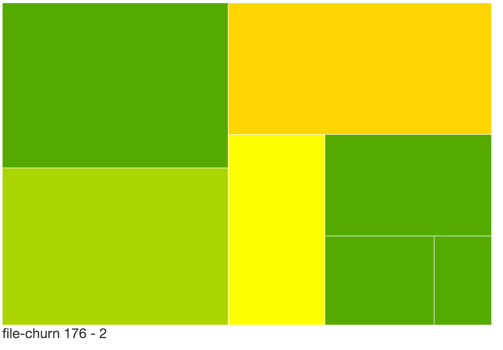

[Vis]ible [Vol]atility

==========

This project is a reaction to the article "Software Volatility" in the
21st issue of [PragPub](http://www.pragprog.com/magazines).  In this
article the authors posit that the volatility, or change, of a file is
proportional to it's "bugginess."  That is, the more often a file is
touched the more likely it is a source of problems in the code base.
Where there is smoke, there is fire.

Purpose
----------

The purpose of visvol is to present the user with a graphical view of
the volatility of a given software project.  It does this by using a
"squarified" [treemap](http://en.wikipedia.org/wiki/Treemapping),
focusing on two indicators of volatility.

1. churn - the total number of lines added or removed

2. commits - the total number of commits to the file

visvol uses area (size) to show the churn of each file relative to
each other, and uses a linear color scale to encode the number of
commits to a file relative to an absolute number.  The result is a
visualization that can quickly tell you what files might be due for
some refactoring.

Getting Started
----------

1. `git clone git://github.com/rzezeski/visvol.git`

2. `cd visvol`

3. `make` (only need to do this once)

4. `./visvol --lookback 2000 . > repo-visvol.html`

5. `open repo-visvol.html`
